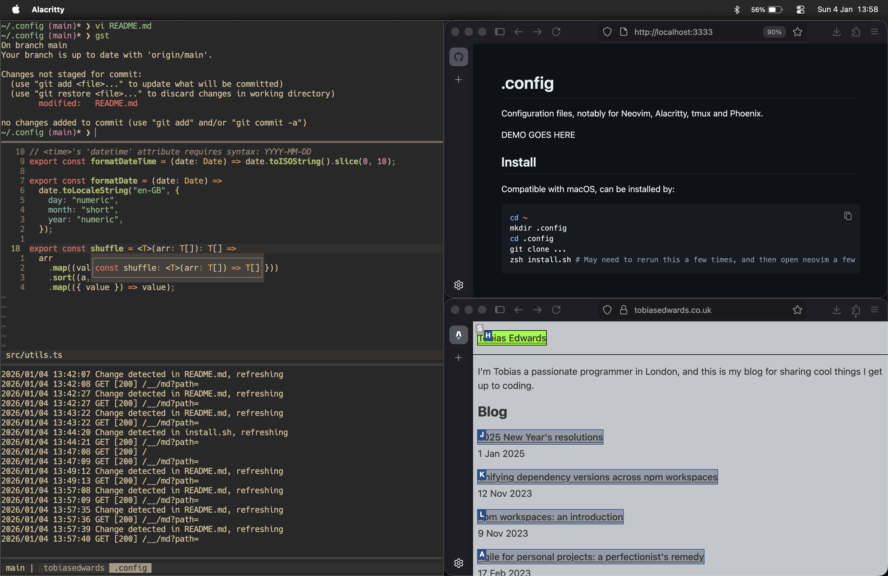

# .config

A minimalist, Vim-centric environment powered by Neovim, Alacritty, tmux, Phoenix, and more.



## Install

Compatible with macOS, can be installed by:

```zsh
cd ~
git clone git@github.com:tobias-edwards/.config.git
cd .config
zsh install.sh # May need to rerun this a few times, and then open neovim a few times
```

## Development

```zsh
mise install        # Install gitleaks, pre-commit
pre-commit install  # Set up pre-commit hook
```
